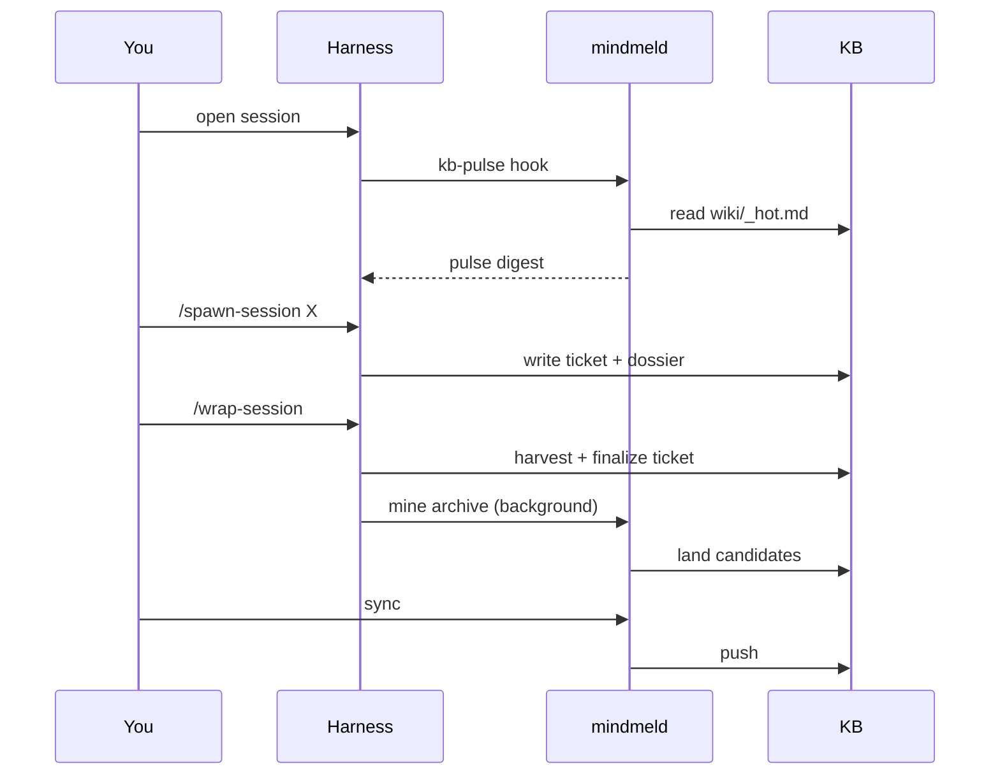

# A day with mindmeld

Getting started tells you how to install mindmeld. This page tells you what
a normal working day looks like once you have.

## Session start

You open your harness in a repo. The `SessionStart` hook (`hooks/kb-pulse.sh`)
runs before you type anything: it reads `wiki/_hot.md` — the pulse cache —
verbatim into the session, then triggers a background refresh. Recall
shouldn't depend on remembering to ask, so the digest of open work and
recent activity is just there when the session opens, trailing reality by
at most one session.

## Spawn a session

You run `/spawn-session <thing>` (or in plain words, "spawn a session for
<thing>"). The [spawn-session](rituals/spawn-session.md) ritual checks out
a feature branch, resolves or drafts a ticket, and builds a plan dossier
under `_plan/` — then pauses for you to review the plan before any code
gets written.

## Work

You work through the session as normal, with the dossier as the plan of
record.

## Self-review

Before you wrap, you run [pr-review](rituals/pr-review.md) in self-review
mode against your own branch — a punch list you can apply fixes from
inline, not an autonomous commenter.

## Wrap

You run `/wrap-session` (or in plain words, "wrap this session").
[wrap-session](rituals/wrap-session.md) runs safety checks for uncommitted
or unpushed work, finalizes the ticket with what was actually built,
harvests the dossier, and captures voice signal from the session — then
removes the worktree.

## In the background

Two things run without you driving them directly:

- `mindmeld mine` turns the session you just closed into candidate
  knowledge-base drafts — quarantined, one fact per file, never touching
  the KB proper until a human says so.
- `mindmeld sweep` bundles the changeset from your branch and lands its own
  swept pattern candidates the same way.

Later — end of day or end of week, not every session — you run
[mine-review](rituals/mine-review.md) to walk the review queue and promote
or reject what landed.

## End of day

You run `mindmeld sync` to pull, reconcile, and push the KB against its
remote — the one command that replaces the pull → merge → regenerate →
commit → push sequence the rituals above would otherwise each repeat.

The diagram below traces one loop of this day: the pulse at session start,
a session opening and closing, mining running in the background, and sync
carrying it all back to the remote.

## Related

- [Concepts](concepts.md) — the rings and recall model behind this day.
- [spawn-session](rituals/spawn-session.md) — the full spawn flow.
- [wrap-session](rituals/wrap-session.md) — the full wrap flow.
- [mine-review](rituals/mine-review.md) — driving the review queue.
- [mindmeld sync](commands/sync.md) — what `mindmeld sync` actually does.
