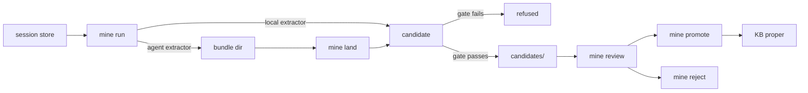

# mindmeld mine

Your agent sessions already hold decisions, patterns, and fixes worth keeping — `mine`
is how they get out of scrollback and into your KB. It reads sessions from the harness's
own store, extracts candidate drafts, and refuses anything too vague to be useful. Every
step is a `mine` subcommand; nothing here writes to the KB proper without a human
promoting it.

## Usage

```bash
mindmeld mine [--dry-run] <subcommand> [flags]

mindmeld mine status [--since 72h] [--project P] [--json]
mindmeld mine run [--session ID] [--project P] [--limit N] [--force] [--extractor auto|local|agent]
mindmeld mine land (--bundle DIR | --all)
mindmeld mine review [--all] [--json]
mindmeld mine promote <slug> [--type DIR]
mindmeld mine reject <slug> --reason "..."
mindmeld mine ledger [--session ID] [--outcome O] [--extractor E] [--json]
mindmeld mine archive [--session ID] [--json]
mindmeld mine prune [--session ID] [--json]
```

`--dry-run` is persistent on `mine` itself — every subcommand shares the same
zero-writes guarantee under one flag.

## What it does

A session moves through six stages, in order. The diagram below shows the path; the
sections after it cover each stage's own flags and output.

The mining lifecycle, from a raw session on disk to a promoted KB article:



## mine status

Reports how many sessions are mineable without touching anything: per-store totals
(a session can live in more than one store — the live harness and the local archive),
how many are still unmined, and how many swept patterns are held below the review
threshold. `--since 72h` narrows to sessions ended in that window; `--project` narrows
to one project.

## mine run

Mines every unmined session, or a narrower set via `--session`, `--project`, `--limit`,
or `--force` (re-mine sessions the ledger already marks done). Which extractor runs
depends on `--extractor` and `[mining].extractor` (config.md#mining): `local` finishes
in-process against an Ollama-compatible endpoint; `agent` writes a bundle directory
(`transcript.md`, a generated `BRIEF.md`) per session and stops there — extraction is
deferred to `mine land`. `auto` tries `local` first when a model is configured and falls
back to `agent` when it's unreachable.

## mine land

Finishes the agent-extraction flow: hands a bundle's `candidates.json` to the same
gate/write path the local extractor uses. `--bundle DIR` lands one bundle; `--all` sweeps
every bundle directory under the work root. `candidates.json` missing is reported and
skipped, not an error — extraction just hasn't happened yet.

## mine review

Lists every candidate presently in the queue: slug, type/domain, anchor count, and — when
a finding has recurred — a corroboration count and the sessions it recurred in. Swept
patterns below `[sweep].promotion.review_min` are held out of the default listing;
`--all` shows them too.

## mine promote

Moves one candidate out of quarantine into the KB proper. `--type` overrides the
destination directory only when the candidate's own type has no obvious one — a swept
pattern always lands flat at `patterns/<slug>.md`, never under a per-project directory.
This is the only command that ever writes outside `candidates/`, and it's always a
person's call.

## mine reject

Removes one candidate. `--reason` is required — it's the only audit trail a rejected
candidate leaves; the file itself is gone, so the ledger row and reason are what remain.

## mine ledger

Reads back the append-only trail every other subcommand writes to, filtered by
`--session`, `--outcome` (`landed|gated|empty|promoted|rejected|error|archived|pruned`),
or `--extractor` (`local|agent`), with a summary count over the filtered set.

## mine archive

Sweeps the live session store into the local spool before it ages out of the harness's
own retention window — the capture half of mining, separate from extraction. Requires
`[mining].archive_dir` to resolve under `$HOME`; the mining ledger is committed and
synced across machines and stores every path `~`-relative, so a spool outside `$HOME`
can't be recorded there at all.

## mine prune

Reclaims spooled sessions the ledger already marks safe to delete — only sessions whose
outcome is `landed`, `promoted`, or `rejected`; a session that gated, came back empty, or
errored is a verdict on the extractor, not the session, so it's kept for another pass.
A session resumed after it was mined is also held back, never reclaimed.

## Output

Report lines are tagged `mine`. A `✓` line is a completed step (`land <slug>
(<n> anchors, <extractor>/<model>)`, `promote <slug> → <path>`); a `−` line is a
gate refusal or a held-back state, naming why (`gate <id>: <reasons>`, `skip <id>:
already mined`). `mine run`'s extractor line reports which one actually ran, including
the local-endpoint fallback to agent when unreachable.

## Config it reads

`[mining]` (min_turns, min_anchors, skip_projects, extractor, local_model,
local_endpoint, local_num_ctx, archive_dir, archive_subagents, archive_keep_mined) and
`[mining.recurrence]` (enabled, threshold, collection, patterns_collection, refresh,
timeout) — see [config.md#mining](../config.md#mining). `mine review`'s surfacing
threshold and auto-promotion come from `[sweep.promotion]` — see
[config.md#sweep](../config.md#sweep).

## Related
- [mindmeld sweep](sweep.md) — the other producer of pattern candidates, from a git diff
  instead of a session transcript
- [mine-review](../rituals/mine-review.md) — the ritual that drives this command surface
  end to end, including the sub-agent fan-out for deferred agent extraction
- [Configuration](../config.md) — the full `[mining]` and `[sweep]` key reference
