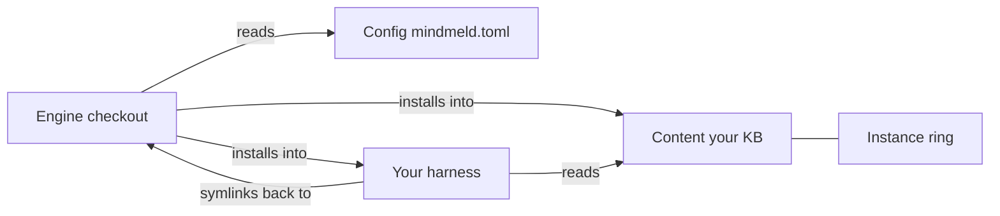

# Concepts

mindmeld splits itself into pieces on purpose, and knowing the pieces
answers most "why does it work this way" questions before you have to ask
them.

## The KB you own

Your knowledge base is a plain-markdown git repo — it lives on your
machine, under your own git history, readable with `cat` if every tool you
own vanished tomorrow. mindmeld ships the other half: the engine. Own the
data, rent the tools — every dependency mindmeld leans on sits behind a
seam, so a tool that stops pulling its weight is a swap, not a rewrite,
because none of them hold your actual content.

## The rings

- **Engine** — the installed mindmeld engine: a Homebrew keg's `libexec` for
  the adopter path, or a source checkout if you're working from one (a
  contributor path). `brew upgrade mindmeld` plus `mindmeld update` brings
  it current; `doctor` and `mindmeld --version` report which ring you're
  running, `managed` or `checkout`.
- **Config** — `mindmeld.toml`, one file naming your KB root and identity.
- **Content** — your KB. Private, never ships, grows however you grow it —
  including the **instance ring** (`{kb}/skills/`), where your own overlays
  and overrides live.

What goes in config versus what goes in the KB isn't a judgment call — it's
one question: would this be true on your other machine? If yes, it's KB. If
no, it's config. [Configuration](config.md) writes the full answer down
under "Config vs KB — the delineation."

The diagram below shows how the four pieces connect: the engine installs
into both your harness and your KB, the harness's installed skills symlink
back into the engine checkout, and every organ reads config to find its way.

## The install is the source of truth

Skills install as symlinks back into the installed engine — a Homebrew
keg's `libexec` for most adopters — not copies. `brew upgrade mindmeld`
bumps the engine; `mindmeld update` then reinstalls the adapter so every
symlink repoints, re-stamps the guide, and syncs the seed-tracked boards and
templates — there's no separate updater and no version to fall out of sync with.
`doctor` classifies every installed skill rather than just testing that
something's there — linked to checkout, linked elsewhere, installed as a
real path, or missing — so drift is a reported line, not a silent failure
mode. If you're working from a source checkout, the same symlinks point
back into it instead, and a plain `git pull` plus `mindmeld update` does
the same job.

## Harness adapters

`claude-code` is the only adapter mindmeld ships today, but the skills
themselves are written harness-agnostic — the direction is that they travel
to whatever agent runtime you're running, not just this one. The adapter
seam (`[install]` in `mindmeld.toml`) is what `init` and `doctor` use to
find and wire up host tooling; see [Configuration](config.md) for its keys.

## Executor classes and routing

A session's work can be carved into chunks and dispatched through a small, portable
vocabulary instead of a vendor's own model names: `mechanical`, `balanced`, `deep`, and
`main-thread`. The first three are ranked calibers a chunk can ask for a minimum of;
`main-thread` is a different axis entirely — it names *who* executes (the session
itself, rather than a delegated child) instead of how capable the executor is, so it's
never compared against a minimum and is always the rung a fallback chain can terminate
on.

That vocabulary answers a different question than a chunk's complexity does, and keeping
them separate is deliberate. Complexity (trivial/standard/complex) describes how big an
edit is; an execution request describes who should run it — and a small change at a
sensitive path is exactly where those two answers diverge: mechanically trivial, and not
work handed to the cheapest available executor on size alone. Two fields instead of one
scalar is what lets a request stay right when an edit's size and its blast radius
disagree.

Routing a chunk into that vocabulary splits the same way the [code-docs
policy](config.md#config-vs-kb--the-delineation) already does. What caliber a kind of
chunk deserves is a preference true on every machine you work from, so it lives in your
KB as a policy file (`policy/chunk-routing.md`); what this particular box can actually
fill a request with is a fact about the machine, so it lives in `mindmeld.toml`'s
`[execution.classes]` table instead. See [Configuration](config.md#execution) for that
table's keys, and [mindmeld doctor](commands/doctor.md#executor-class-mapping) for how a
collapsed or unmapped class mapping gets reported.

The policy file's rules apply once, when a chunk is declared, and come in two kinds that
behave differently on purpose. A rule setting a minimum composes a **floor**, an
engine-owned value the routing policy alone writes onto the chunk's execution
request — a chunk that already states its own floor is refused outright, naming the
chunk, since it is not the caller's to state. The floor binds harder than an ordinary
minimum: it survives every later reroute (a route may lower a chunk's caliber, but
never below its own floor), and a routing entry — stated on the chunk or filled in by
policy — that could ever land the chunk below it is refused at declare, naming the
rule that set it. A rule setting a class is a **default**: it only ever fills in a
preferred class the chunk left unset, clamped up to the floor when the result would
otherwise land below it, and never overrules a class the chunk states. A
`contract-question` rule is a third case, and not really a preference at all: contract
or product judgment always returns to the main thread, so the engine refuses any rule
— spec or policy — routing that trigger anywhere else, the same way it refuses one
for `chunk.reroute` to honor if it somehow existed. Leaving the policy file unwritten
resolves to this engine's own built-in defaults; writing one that doesn't parse refuses
the declare instead of silently falling back to those defaults — a misspelled rule is a
loud failure, not a rule that stopped applying. That includes a rule's own `when`: it
must be either a known trigger (`contract-question`, `failed-verification`, ...) or a
`<trait>:<value>` pair from the same closed vocabulary a chunk's own traits are checked
against (`complexity`, `risk`, `judgment`, `context_scope`, each with its own closed set
of values) — `riks:high` or `risk:hgih` refuses the whole policy file, naming the rule,
rather than silently compiling into a rule that can never match anything.

## Recall

Two paths, not one. At session start, the pulse hook injects a compact
digest of open work and recent activity — recall that doesn't depend on
remembering to ask. On demand, `qmd` is the search engine behind both the
pulse and anything you query yourself; it's a required dependency for
exactly that reason. See
[A day with mindmeld](a-day-with-mindmeld.md) for where recall shows up
across a working day.

## Related

- [Getting started](getting-started.md) — install and run your first
  session.
- [Your KB, directory by directory](kb-layout.md) — where each ring's
  content actually lands on disk.
- [Configuration](config.md) — the full config-vs-KB delineation and
  schema.
