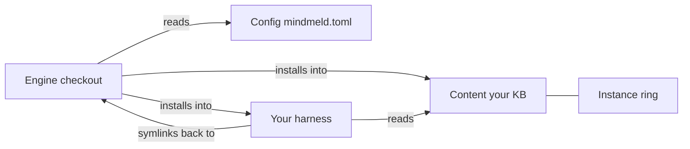

# Concepts

mindmeld splits itself into pieces on purpose, and knowing the pieces
answers most "why does it work this way" questions before you have to ask
them.

## The KB you own

Your knowledge base is a plain-markdown git repo — it lives on your
machine, under your own git history, readable with `cat` if every tool you
own vanished tomorrow. mindmeld ships the other half: the engine. Own the
data, rent the tools — every dependency mindmeld leans on sits behind a
seam, so a tool that stops pulling its weight is a swap, not a rewrite,
because none of them hold your actual content.

## The rings

- **Engine** — the installed mindmeld engine: a Homebrew keg's `libexec` for
  the adopter path, or a source checkout if you're working from one (a
  contributor path). `brew upgrade mindmeld` plus `mindmeld update` brings
  it current; `doctor` and `mindmeld --version` report which ring you're
  running, `managed` or `checkout`.
- **Config** — `mindmeld.toml`, one file naming your KB root and identity.
- **Content** — your KB. Private, never ships, grows however you grow it —
  including the **instance ring** (`{kb}/skills/`), where your own overlays
  and overrides live.

What goes in config versus what goes in the KB isn't a judgment call — it's
one question: would this be true on your other machine? If yes, it's KB. If
no, it's config. [Configuration](config.md) writes the full answer down
under "Config vs KB — the delineation."

The diagram below shows how the four pieces connect: the engine installs
into both your harness and your KB, the harness's installed skills symlink
back into the engine checkout, and every organ reads config to find its way.

## The install is the source of truth

Skills install as symlinks back into the installed engine — a Homebrew
keg's `libexec` for most adopters — not copies. `brew upgrade mindmeld`
bumps the engine; `mindmeld update` then reinstalls the adapter so every
symlink repoints, re-stamps the guide, and syncs the seed-tracked boards —
there's no separate updater and no version to fall out of sync with.
`doctor` classifies every installed skill rather than just testing that
something's there — linked to checkout, linked elsewhere, installed as a
real path, or missing — so drift is a reported line, not a silent failure
mode. If you're working from a source checkout, the same symlinks point
back into it instead, and a plain `git pull` plus `mindmeld update` does
the same job.

## Harness adapters

`claude-code` is the only adapter mindmeld ships today, but the skills
themselves are written harness-agnostic — the direction is that they travel
to whatever agent runtime you're running, not just this one. The adapter
seam (`[install]` in `mindmeld.toml`) is what `init` and `doctor` use to
find and wire up host tooling; see [Configuration](config.md) for its keys.

## Recall

Two paths, not one. At session start, the pulse hook injects a compact
digest of open work and recent activity — recall that doesn't depend on
remembering to ask. On demand, `qmd` is the search engine behind both the
pulse and anything you query yourself; it's a required dependency for
exactly that reason. See
[A day with mindmeld](a-day-with-mindmeld.md) for where recall shows up
across a working day.

## Related

- [Getting started](getting-started.md) — install and run your first
  session.
- [Your KB, directory by directory](kb-layout.md) — where each ring's
  content actually lands on disk.
- [Configuration](config.md) — the full config-vs-KB delineation and
  schema.
